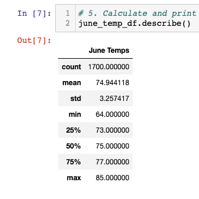
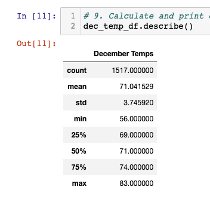

# Module 9 Challenge: Surfs Up

## Overview

- The purpose of this analysis is to analyze the temperature data in Oahu for the months of June and December to determine the year-round viability of a surf and ice cream shop.
- Analysis involves using SQLAlchemy, NumPy, and Pandas to pull data from SQL database, do basic cleaning, and analyze the data.
    - After pulling data from the SQL database using SQLAlchemy:
        - Converted the list of tuples holding the temperatures into a list using NumPy
        - Converted the list into a Pandas DataFrame
        - Gathered summary statistics using Pandas .describe() method.

## Results

- The June temperatures are ideal for a surf and ice cream shop:
    - Min. temp: 64.0°F
    - Max. temp: 85.0°F 
    - Avg. temp: 74.9°F

    

- The December tempatures are quite mild and would also be suitable for the surf and ice cream shop
    - Min. temp: 56.0°F 
    - Max. temp: 83.0°F 
    - Avg. temp: 71.0°F

    

- While the low temperatures in December are cooler, the average temperatures are quite similar and June and December both have very similar temperature standard deviations:
    - June Temp Standard Deviation: 3.26
    - December Temp Standard Deviation: 3.75

## Summary

- This analysis compares the temperatures for the month of June and December in Oahu to determine business sustainability for a surf and ice cream shop. 

- Because the temperatures are quite similar and have similar average temperatures and standard deviation, this does seem like a viable business plan based on temperatures alone.

- There are additional queries that could aid in further analysis:  
    1. Analyze the rainfall for both June and December to see if one month's precipitation could negatively impact business.
    2. Analyze the months of January and February for both temperature and precipitation to see if there is a difference in these deeper winter months.